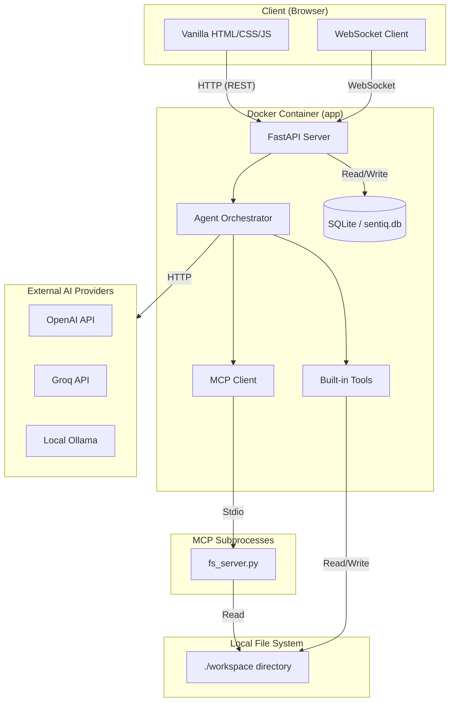
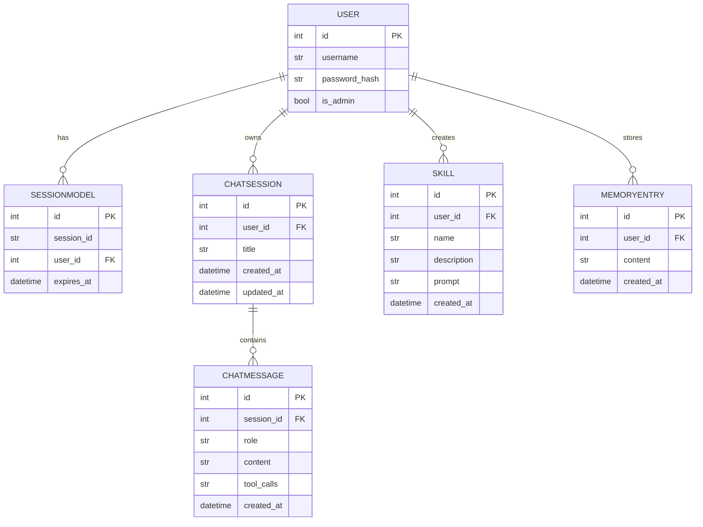

# Sentiq.AI Architecture Report

## 1. Executive Summary

Sentiq.AI is a self-hosted, all-in-one AI productivity workspace designed for solo developers and small teams. It unifies intelligent chat, autonomous agent workflows, document editing, email, notes, and calendar into a single, locally deployed dashboard. The application is built on a containerized FastAPI backend, uses a local SQLite database (SQLModel) to maintain self-hostability on free-tier infrastructure, and serves a lightweight vanilla HTML/CSS/JS frontend. Currently, **Phase 1 (Foundation)** and **Phase 2 (Chat + Agents)** are fully completed, establishing the core infrastructure, authentication, provider abstractions, WebSocket streaming chat, and Model Context Protocol (MCP) tool calling.

## 2. System Architecture

**Request Lifecycle (Sending a Chat Message):**
1. The user types a message in the browser UI and hits send. The JS frontend sends a JSON payload containing the `message`, selected `provider`, and `model` over the established WebSocket connection to the `/chat/ws/{session_id}` endpoint.
2. The FastAPI WebSocket route receives the payload, verifies the user's session cookie, and commits the user's message to the SQLite `ChatMessage` table.
3. The route fetches the user's chat history, long-term memory (`MemoryEntry`), and saved `Skill`s from the DB, injecting memory/skills into the system prompt.
4. It calls `run_agent_loop` in the Agent Orchestrator, which fetches the available tools (built-in + MCP tools) and sends the payload to the selected LLM provider via the abstraction layer.
5. The provider streams back chunks (text or tool calls). The orchestrator forwards text chunks directly to the WebSocket client (which renders them via Marked.js and DOMPurify).
6. If the LLM requests a tool call, the orchestrator executes the local tool (e.g., `write_file`) or forwards it to the `MCPClient`, streams a status indicator to the UI, appends the tool's result to the message history, and recursively queries the LLM again.
7. Upon completion, the full assistant message is saved to the DB, and a `done` signal is sent to the client.

## 3. Folder-by-Folder Breakdown

*   **`core/`**: Contains the central backend logic, database setup, security, and agent orchestrators.
    *   `auth.py`: Handles cookie-based user session validation and FastAPI dependency injection.
    *   `config.py`: Defines the `Settings` schema (loaded from `.env`) via `pydantic-settings`.
    *   `database.py`: Instantiates the SQLite `engine` and provides the DB session dependency.
    *   `limiter.py`: Configures the `SlowAPI` rate limiter.
    *   `models.py`: Defines all SQLModel ORM classes (database tables).
    *   `security.py`: Handles bcrypt password hashing, verification, and random string generation.
    *   **`core/agents/`**: Contains the intelligent agent logic.
        *   `agent.py`: The core LLM orchestration loop (`run_agent_loop`), handling streaming and tool resolution.
        *   `mcp_client.py`: Manages subprocess connections to MCP servers via the official `mcp.client.stdio` module.
        *   `tools.py`: Implements built-in tools (`read_file`, `write_file`, `save_memory`) with path-jailing constraints.
    *   **`core/providers/`**: The LLM abstraction layer.
        *   `__init__.py`: Factory function `get_provider` that returns configured provider instances.
        *   `base.py`: Abstract Base Class defining the `generate_stream` interface.
        *   `openai_compat.py`: The universal adapter using `httpx` to communicate with OpenAI-compatible APIs (OpenAI, Groq, Ollama).
*   **`routes/`**: FastAPI route handlers.
    *   `auth.py`: REST endpoints for `/login` and `/logout` with rate limiting.
    *   `chat.py`: REST endpoints for session CRUD and the WebSocket endpoint for real-time chat.
    *   `system.py`: Contains the `/health` check endpoint.
    *   `ui.py`: Serves the frontend HTML templates (`/` and `/login`) and enforces auth redirects.
    *   *`pages.py`*: **[UNUSED/STUBBED]** Contains an old JWT-based routing approach. Not wired into `app.py`.
*   **`models/`**: **[UNUSED]** An empty scaffold directory (database models are actually in `core/models.py`).
*   **`mcp_servers/`**: Dedicated directory for external Model Context Protocol servers.
    *   `fs_server.py`: A basic `FastMCP` filesystem server exposing `list_workspace_dir` and `read_workspace_file`.
*   **`static/`**: Frontend assets served directly to the browser.
    *   `index.html`: The main dashboard view containing the chat interface and placeholders for future modules.
    *   `login.html`: The login page UI.
    *   **`static/css/`**
        *   `style.css`: The central vanilla CSS stylesheet containing CSS variables (colors), layouts, and chat bubble styles.
    *   **`static/js/`**
        *   `app.js`: Frontend logic for view switching, WebSocket connections, DOM update, and sanitization.
*   **Root Files**:
    *   `app.py`: The FastAPI application entry point, lifecycle manager (generates admin on first run), and router registry.
    *   `docker-compose.yml` & `Dockerfile`: Infrastructure definition for deploying the app container.
    *   `.env` & `.env.example`: Environment variables and secrets.
    *   `requirements.txt`: Python dependencies.

## 4. Data Model

**Per-User Scoping:**
- `User` table acts as the central pivot.
- `SessionModel` enforces authentication scoping by linking a secure HTTP-only cookie (`session_id`) to a `user_id`.
- `ChatSession`, `Skill`, and `MemoryEntry` all contain a `user_id` foreign key. The backend enforces scoping by explicitly querying `where(model.user_id == user.id)` in `routes/chat.py` (for sessions) and `core/agents/agent.py` (for memories/skills).
- `ChatMessage` is scoped by `session_id`, which is recursively verified against `ChatSession.user_id` during websocket connection.

## 5. Authentication & Security

- **Session Flow**: 
  - User submits credentials to `POST /auth/login`.
  - Backend verifies the bcrypt hash.
  - Generates a cryptographically random `session_id` string.
  - Stores `session_id` mapping to `user_id` with an expiry date (7 days) in the database (`SessionModel`).
  - Sets an `HttpOnly`, `SameSite=lax` cookie named `session_id`.
  - Protected endpoints use the `get_current_user` dependency to read the cookie, query `SessionModel`, verify expiry, and return the `User`.
- **WebSocket Auth**: Since WebSockets cannot easily use FastAPI dependencies with HTTP exceptions, `routes/chat.py` manually reads the `session_id` cookie upon connection, fetches the user, and closes the socket if invalid.
- **Secrets Management**:
  - `SECRET_KEY`: Used for generic cryptographic needs, loaded from `.env`.
  - `OPENAI_API_KEY`: Stored in `.env`, passed directly to `httpx` headers in memory.
  - `GROQ_API_KEY`: Stored in `.env`, passed directly to `httpx` headers in memory.
  - Admin Password: Dynamically generated on first run (`app.py` lifespan) and printed to stdout. Bcrypt hash is stored in DB. No plaintext password is ever saved.
- **Rate Limiting**:
  - `POST /auth/login` is strictly rate-limited to **5 requests per minute** to prevent brute force attacks, utilizing `slowapi`.

## 6. AI/Agent Layer

- **Provider Abstraction**: Managed by `core/providers/`. `base.py` defines an `AsyncGenerator` interface yielding dict chunks (`{"type": "content", "delta": ...}` or `{"type": "tool_calls", ...}`). Currently, `OpenAICompatProvider` handles OpenAI, Groq, and Ollama by swapping the base URL and API keys since all three support the OpenAI chat completions schema. To add a new provider (e.g., Anthropic), one would create an `AnthropicProvider(BaseProvider)` in this folder and register it in `core/providers/__init__.py`.
- **Agent Loop** (`core/agents/agent.py`):
  1. Queries DB for `MemoryEntry` and `Skill` associated with the user, injecting them into the System prompt.
  2. Polls `mcp_manager` for external tools and combines them with `BUILTIN_TOOLS`.
  3. Sends messages to Provider.
  4. Yields text directly to the user UI.
  5. If tools are requested, extracts the JSON arguments, yields a `tool_status` string to the UI, routes the execution to `tools.py` or `mcp_client.py`, appends the tool's output to the message stack, and loops (max 5 iterations) until the LLM returns standard text.
- **Tools**:
  - `read_file(path)`: Built-in. Reads a text file. **Constraint**: Sandboxed to `/app/workspace` using `os.path.realpath` bounds checking.
  - `write_file(path, content)`: Built-in. Writes to a file. **Constraint**: Sandboxed to `/app/workspace` (rejects `../` traversal).
  - `save_memory(content)`: Built-in. Saves a string to the `MemoryEntry` DB table for persistent contextual awareness.
- **MCP Servers**: `core/agents/mcp_client.py` uses the official `mcp.client.stdio` library to spawn a subprocess running `mcp_servers/fs_server.py`. The FastMCP server dynamically registers two tools (`list_workspace_dir` and `read_workspace_file`), both of which also strictly enforce workspace directory jailing.

## 7. Feature-by-Feature Status

| Feature | Status | Key Files | Known Limitations / TODOs |
| :--- | :--- | :--- | :--- |
| **Chat & Agents** | **Complete** | `routes/chat.py`, `core/agents/agent.py`, `static/js/app.js` | UI is functional. Needs shell execution tools (deferred to a later phase due to sandboxing concerns). |
| **Deep Research** | Not Started | N/A | UI placeholder exists in `index.html`. |
| **Compare** | Not Started | N/A | UI placeholder exists. |
| **Documents** | Not Started | N/A | UI placeholder exists. |
| **Email** | Not Started | N/A | UI placeholder exists. IMAP/SMTP not configured. |
| **Notes / Tasks** | Not Started | N/A | UI placeholder exists. |
| **Calendar** | Not Started | N/A | UI placeholder exists. CalDAV not configured. |
| **Scheduled Tasks** | Not Started | N/A | No background worker/cron system currently integrated. |

## 8. External Dependencies

**Python Backend (requirements.txt):**
- `fastapi` / `uvicorn`: Web framework and ASGI server. (Load-bearing)
- `sqlmodel`: ORM bridging Pydantic and SQLAlchemy. (Load-bearing)
- `passlib[bcrypt]` / `bcrypt==3.2.2`: Password hashing. (Load-bearing)
- `python-multipart`: For form data parsing.
- `slowapi`: Rate limiting (used for `/login`).
- `jinja2`: For rendering initial HTML templates.
- `pydantic-settings`: Structured `.env` validation.
- `websockets`: For real-time chat streaming. (Load-bearing)
- `httpx`: Async HTTP client for communicating with LLM providers. (Load-bearing)
- `mcp==1.1.2`: Official Model Context Protocol SDK. (Load-bearing for tools)

**Frontend (CDN in `index.html`):**
- `marked.min.js`: Parses LLM markdown responses into HTML on the client. (Load-bearing)
- `purify.min.js` (DOMPurify): Sanitizes HTML output to prevent XSS attacks before injecting into the DOM. (Load-bearing / Security)
- Google Fonts (Inter).

**External Services / APIs:**
- **OpenAI API**: Activated via `OPENAI_API_KEY`, default URL `https://api.openai.com/v1`.
- **Groq API**: Activated via `GROQ_API_KEY`, forced URL `https://api.groq.com/openai/v1`.
- **Ollama**: Local container/host service via `OLLAMA_BASE_URL` (default `http://host.docker.internal:11434`).

## 9. Deployment

- **Infrastructure**: Configured entirely in `docker-compose.yml`. It defines a single `app` service built from `./Dockerfile` (Python 3.11 slim).
- **Execution Flow** (`docker compose up -d --build`):
  1. Base Python image is pulled, `workspace` directory is created, and dependencies are installed via `pip`.
  2. Source code is copied into `/app`.
  3. Uvicorn starts the FastAPI server.
  4. FastAPI `lifespan` triggers: SQLModel auto-creates the SQLite file (`sentiq.db`) and tables if missing.
  5. The lifespan function searches for a user named `admin`. Finding none on first run, it generates a random password, hashes it, saves the admin user, and logs the plaintext password to standard output (`docker compose logs app`).
  6. The application binds to port `8000`.

## 10. Known Gaps / Next Steps

- **Shell Execution Sandbox**: Cut from Phase 2. The ability for the agent to execute arbitrary shell commands requires a dedicated, isolated sandbox executor (hard resource limits, no network, no docker socket access). Must be built in a future phase.
- **UI Settings Configuration**: The settings tab (Skills, Memory management) exists in HTML but lacks frontend JavaScript wiring and backend CRUD endpoints (beyond the agent's internal `save_memory` tool).
- **Dead Code Cleanup**: `routes/pages.py` and the empty `models/` directory exist but are disconnected from the application graph. They should be deleted to prevent confusion.
- **Session Expiration Cleanup**: While expired sessions are rejected, there is no cron/background job to purge old `SessionModel` rows from the SQLite database.
